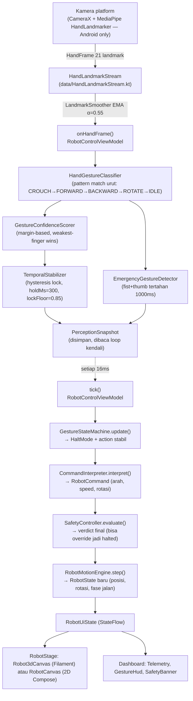
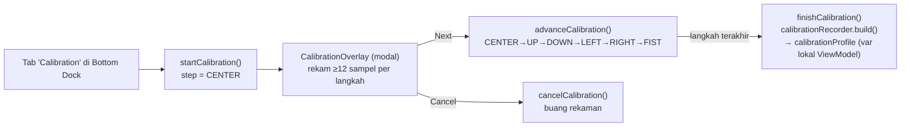
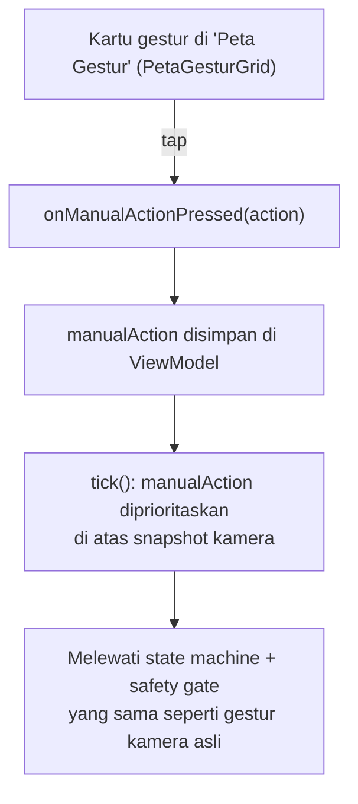

# Alur Kerja & Arsitektur — Robot Gesture Controller

> Dokumen ini menjelaskan konsep flow dan kerangka kerja project **TheExcerimantal** saat ini
> (per commit `c42e003`), berdasarkan pembacaan langsung source code, bukan asumsi.
> Untuk daftar bagian yang belum selesai / tidak sinkron dengan flow ini, lihat
> [`AUDIT_INCOMPLETE.md`](./AUDIT_INCOMPLETE.md). Untuk skenario pengujian manual, lihat
> [`TEST_CASES.md`](./TEST_CASES.md).

## 1. Ringkasan Project

Project ini adalah aplikasi **Kotlin Multiplatform (KMP)** yang mengendalikan model robot 3D
menggunakan **gestur tangan** yang ditangkap kamera, dengan render 3D memakai **Filament KMP**.

| Modul | Peran |
|---|---|
| `shared` | Seluruh logika (data, domain, presentation) + UI Compose Multiplatform — dipakai oleh 3 platform |
| `androidApp` | Entry point Android (`MainActivity` → `App()`) |
| `desktopApp` | Entry point Desktop/JVM (`main()` → `Window { App() }`) |
| `iosApp` | Xcode project yang memuat `Shared.framework` via `MainViewController()` |

Satu-satunya entry UI (`App.kt`) membungkus `RobotControlScreen()` untuk ketiga platform —
tidak ada layar khusus per platform.

## 2. Lapisan Arsitektur (`shared/src/commonMain/kotlin/com/experimental/robot`)

```
data/            → jembatan I/O: stream landmark tangan, status tracker, FPS meter
domain/
  calibration/   → wizard kalibrasi ambang batas gestur
  command/       → menerjemahkan gestur terkunci menjadi RobotCommand (arah, kecepatan, rotasi)
  gesture/       → klasifikasi gestur, smoothing, stabilisasi temporal, deteksi darurat
  model/         → data class murni (RobotAction, RobotCommand, RobotState, HaltMode, dll.)
  motion/        → simulasi fisik robot (posisi, rotasi, fase jalan)
  safety/        → gerbang keselamatan terakhir sebelum command dieksekusi
presentation/
  render/        → renderer 3D perangkat lunak (rasterizer + OBJ loader) — lihat catatan §6
  ui/            → seluruh Composable (dashboard, kamera preview, panggung 3D/2D, dst.)
  viewmodel/     → RobotControlViewModel — orkestrator seluruh pipeline
di/              → RobotGraph, service locator manual (tanpa framework DI)
```

Alur dependensi selalu satu arah: `presentation → domain → data`. Semua kelas domain adalah
fungsi murni (`evaluate()`, `step()`, `interpret()`, `classify()`) yang menerima state dan
mengembalikan state baru — memudahkan pengujian unit tanpa mocking.

## 3. Dua Clock yang Berjalan Terpisah

Ini adalah keputusan desain inti (didokumentasikan di
`RobotControlViewModel.kt:38-52`) dan kunci untuk memahami seluruh flow:

- **Jalur Persepsi** (`onHandFrame()`) — berdenyut mengikuti FPS kamera (variabel, tipikal
  15–30 FPS di Android). Tugasnya **hanya** mengubah 21 landmark MediaPipe menjadi
  `PerceptionSnapshot`; **tidak ada keputusan gerak** yang diambil di sini.
- **Loop Kendali** (`startControlLoop()`) — berdenyut **tetap 60 FPS** (`FRAME_INTERVAL_MS = 16L`).
  Di sinilah state machine, interpreter, safety controller, dan motion engine dijalankan setiap
  tick, **terlepas dari apakah frame kamera baru datang atau tidak**.

Alasannya: kalau keputusan diambil langsung di callback kamera, kamera yang macet/berhenti
mengirim frame tidak akan pernah terdeteksi sebagai "tangan hilang" — robot akan terus bergerak
dengan perintah terakhirnya selamanya. Dengan loop kendali independen, tangan yang keluar frame
dan kamera yang macet ditangani oleh mekanisme timeout yang sama (lihat §5).

## 4. Flow End-to-End (jalur gestur kamera)



### Tahapan detail

1. **Capture kamera** (`CameraFeed.android.kt`) — CameraX `ImageAnalysis` 640×480, kamera depan
   dicerminkan, dikirim ke `HandLandmarkerDetector` (MediaPipe `HandLandmarker`, mode
   `LIVE_STREAM`, CPU delegate).
2. **Buffering & smoothing** — `HandLandmarkStream` menyiarkan `Flow<HandFrame?>` (replay=1,
   drop-oldest) yang di-pipe lewat `LandmarkSmoother` (EMA per landmark).
3. **Klasifikasi gestur** — `HandGestureClassifier.classify(hand)` mencocokkan pola jari secara
   berurutan: `CROUCH → MOVE_FORWARD → MOVE_BACKWARD → ROTATE_LEFT/RIGHT → IDLE` (fallback,
   termasuk kepalan tangan biasa).
4. **Skoring kepercayaan** — `GestureConfidenceScorer` memberi skor berbasis margin; kejelasan
   jari dihitung dengan `minOf` (bukan rata-rata) sehingga satu jari ambigu menjatuhkan skor
   keseluruhan.
5. **Stabilisasi temporal** — `TemporalStabilizer` mengunci gestur baru hanya setelah confidence
   ≥ 0.85 bertahan 300ms berturut-turut (berbasis waktu, bukan jumlah frame).
6. **Deteksi darurat** — paralel dengan klasifikasi biasa: `EmergencyGestureDetector` mendeteksi
   kepalan tangan + ibu jari terentang yang tertahan 1000ms (pose yang sengaja dipilih karena
   tidak bisa tercapai lewat gestur normal manapun).
7. **State machine** (`GestureStateMachine.update()`) — otoritas tunggal transisi `HaltMode`,
   urutan prioritas: latch aktif → emergency → tangan hilang ≥2000ms (SAFETY_LOCK) → tangan
   hilang ≥300ms (STOP) → confidence rendah (STOP) → berjalan normal (RUNNING).
8. **Interpreter** (`CommandInterpreter.interpret()`) — mengubah `action` + titik kontrol
   (posisi pergelangan tangan di layar) menjadi `RobotCommand` dengan magnitude dari
   `ControlSpace` (dead-zone + radius) dan dihaluskan `SlewRateLimiter` (naik 2.5/s, turun 6/s
   — lebih cepat berhenti daripada mulai bergerak).
9. **Safety gate** (`SafetyController.evaluate()`) — pemeriksaan berlapis terakhir sebelum
   command dieksekusi (detail di §5).
10. **Motion engine** (`RobotMotionEngine.step()`) — simulasi fisik murni: posisi Z, rotasi Y,
    fase jalan, berdasarkan `command.speed`/`command.rotation` (mendekati bagaimana robot fisik
    nanti akan membaca command yang sama persis).
11. **Render** — `RobotUiState` (StateFlow) diobservasi `RobotControlScreen`; `RobotStage`
    memilih `Robot3dCanvas` (mode 3D, Filament) atau `RobotCanvas` (mode 2D, Compose Canvas)
    sesuai `renderMode`.

## 5. Flow Keselamatan (Safety / Emergency Stop)

Ini adalah bagian paling kritis dari sistem — didesain berlapis (*defense in depth*).

```mermaid
flowchart TD
    G1["Gestur darurat terdeteksi kamera\n(fist+thumb, 1000ms)"] --> S["snapshot.emergencyTriggered"]
    G2["Tombol EMERGENCY STOP di UI"] --> R["emergencyRequested flag\n(terpisah dari snapshot agar tak\ntertimpa frame kamera berikutnya)"]
    S --> OR["tick(): perception.emergencyTriggered OR requested"]
    R --> OR
    OR --> SM["GestureStateMachine\n→ latch EMERGENCY_STOP"]
    SM --> CI["CommandInterpreter\nhalted=true → speed=0, rotation=0"]
    CI --> SC["SafetyController\ncek ulang halt.blocksMovement\n→ command.halted() (redundan, independen)"]
    SC --> ME["RobotMotionEngine\nhanya menerima command nol"]
    ME --> UI["Banner merah '<HALT> AKTIF' + tombol RESET ROBOT"]
    UI -->|resetRobot()| CLEAR["Reset semua state,\nsatu-satunya jalan keluar latch"]
```

**Urutan gerbang `SafetyController` (7 tahap, fail-closed):**

1. `machine.halt.blocksMovement` (keputusan state machine — emergency/hand-lost/low-confidence)
2. `confidence < 0.50` → `STOP` / `LOW_CONFIDENCE`
3. Sedang bergerak & `detectionFps` di bawah 15 (tapi bukan 0/belum pernah terukur) → `STOP` / `LOW_FRAME_RATE`
4. Jika `requireRobotLink == false` (mode simulasi) → langsung `RUNNING`, **lewati tahap 5–7**
5. `linkConnected != true` → `STOP` / `LINK_LOST`
6. `now - lastAckAtMs > 500ms` → `STOP` / `COMMAND_TIMEOUT`
7. `batteryPercent < 15` → `STOP` / `BATTERY`
8. Bergerak maju & `obstacleDistanceCm < 25` → `STOP` / `OBSTACLE`

**Nilai `HaltMode`:** `RUNNING` (jalan normal) · `STOP` (pulih otomatis begitu penyebab hilang)
· `EMERGENCY_STOP` (dipicu pengguna, terkunci/*latched*) · `SAFETY_LOCK` (dipicu sistem — tangan
hilang ≥2s — terkunci juga, tapi beda `StopReason` untuk telemetri/UI).

Latch (`EMERGENCY_STOP`/`SAFETY_LOCK`) **hanya** bisa dilepas lewat `resetRobot()` — tidak ada
pemulihan otomatis, ini disengaja.

> ⚠️ **Catatan penting:** tahap 5–8 (link robot fisik, baterai, timeout command, obstacle) **tidak
> pernah aktif** pada build saat ini karena `requireRobotLink` di-hardcode `false`
> (`RobotControlViewModel.kt:229`) dan tidak ada jalur kode yang mengubahnya. Detail dan dampaknya
> ada di [`AUDIT_INCOMPLETE.md`](./AUDIT_INCOMPLETE.md#3-mode-simulation-vs-real-robot-hanya-kosmetik).

## 6. Flow Rendering 3D/2D

`RobotStage` (`RobotControlScreen.kt:299-314`) memilih salah satu dari dua renderer aktif
berdasarkan `RobotUiState.renderMode`:

- **`THREE_D` → `Robot3dCanvas`** — dibangun di atas **Filament KMP**
  (`io.github.erkko68.filament`), render PBR hardware-accelerated dengan directional light,
  bloom/FXAA, dan kamera orbit-drag. Model robot dirakit langsung dari primitif Filament
  (`Cube`/`Cylinder`/`Sphere`/`Group`).
- **`TWO_D` → `RobotCanvas`** — gambar prosedural 2D memakai Compose `Canvas`/`DrawScope`
  langsung, independen dari Filament.

Toggle mode dilakukan lewat `viewModel.toggleRenderMode()`, dipicu dari kartu "Mode & View" di
kolom kanan dashboard.

> Ada satu implementasi renderer 3D ketiga (`presentation/render/*`: `SoftwareRenderer`,
> `RobotMeshBuilder`, `ObjMeshLoader`) yang **tidak pernah dipanggil** dari `RobotStage` maupun
> Composable manapun — lihat detail di
> [`AUDIT_INCOMPLETE.md`](./AUDIT_INCOMPLETE.md#1-tiga-implementasi-renderer-robot-3d--hanya-2-yang-terpakai).

## 7. Flow Kalibrasi

Wizard 6 langkah untuk menyesuaikan ambang batas gestur ke ukuran tangan/kamera pengguna:



Profil kalibrasi (`CalibrationProfile`) dirancang untuk diterapkan ke `GestureConfig` dan
`ControlSpaceConfig` lewat `applyTo()`, dan secara arsitektural **seharusnya** membuat gestur
lebih akurat untuk tangan/kondisi pencahayaan pengguna tertentu setelah wizard selesai.

> ⚠️ **Pada implementasi saat ini, hasil kalibrasi tidak pernah kembali ke pipeline yang
> berjalan** — lihat temuan kritis di
> [`AUDIT_INCOMPLETE.md`](./AUDIT_INCOMPLETE.md#2-hasil-kalibrasi-tidak-pernah-diterapkan-ke-pipeline-aktif).

## 8. Flow Kontrol Manual

Jalur alternatif ketika kamera tidak tersedia (iOS/Desktop) atau pengguna ingin override manual:



> ⚠️ **Jalur ini punya bug fungsional serius**: `onManualActionReleased()` ada di ViewModel
> tapi tidak pernah dipanggil dari UI manapun — sekali tap, override manual mengunci permanen
> sampai pengguna menekan Emergency Stop atau Reset. Detail lengkap di
> [`AUDIT_INCOMPLETE.md`](./AUDIT_INCOMPLETE.md#4-kontrol-manual-tap-gestur-macet-permanen--stuck-override-bug-paling-serius).

## 9. Struktur Layar (Dashboard)

```
┌─────────────────────────────── TopDashboardBar ───────────────────────────────┐
│  Logo · Status Pill  ...........................  [Settings⚙] [Menu☰] (no-op) │
├──────────────┬─────────────────────────────────┬──────────────────────────────┤
│ Kolom Kiri    │ Kolom Tengah                    │ Kolom Kanan                  │
│ • Kamera      │ • RobotStage (3D/2D)            │ • Peta Gestur (6 kartu)      │
│   Preview     │ • CenterActionDeck              │ • Gesture & Hand Info        │
│ • Telemetry   │   (aksi saat ini, EMERGENCY     │ • Mode & View (3D/2D,        │
│ • Tips        │    STOP, Reset)                 │   Simulation/Real Robot*)    │
├──────────────┴─────────────────────────────────┴──────────────────────────────┤
│  BottomNavigationDock: Home · Calibration · Record* · Replay* · Settings*      │
└──────────────────────────────────────────────────────────────────────────────┘
   Overlay: Banner merah HALT (saat latched) · Modal Wizard Kalibrasi
```
`*` = lihat audit, tab/kontrol ini belum punya fungsi nyata di belakangnya.

Layout responsif: 3 kolom untuk layar ≥860dp, tumpuk vertikal + scroll untuk layar sempit
(`RobotControlScreen.kt:69,80,160`).

## 10. Dukungan Platform

| Kemampuan | Android | Desktop (JVM) | iOS |
|---|---|---|---|
| UI dashboard, safety, motion, kalibrasi | ✅ | ✅ | ✅ |
| Render 3D (Filament) | ✅ | ✅ | ✅ |
| Kamera + hand tracking (MediaPipe) | ✅ (CameraX + MediaPipe) | ❌ (stub placeholder) | ❌ (stub placeholder) |
| Fallback saat tanpa kamera | Kontrol manual (tap, **buggy** — lihat audit) | sama | sama |

`CameraFeed` adalah `expect`/`actual`; hanya `actual` Android yang benar-benar mengimplementasi
capture + inferensi. `actual` iOS dan JVM langsung mempublikasikan
`TrackerStatus.Unsupported(...)` dan menampilkan placeholder statis.

## 11. Testing Otomatis yang Sudah Ada

11 file test domain murni di `shared/src/commonTest/.../robot/` (~124 `@Test`), mencakup:
`CalibrationProfile`/`CalibrationRecorder`, `CommandInterpreter`, `ControlSpace`,
`GestureConfidenceScorer`, `GestureStateMachine`, `HandGestureClassifier`, `RobotMotionEngine`,
`SafetyController`, `TemporalStabilizer`, plus test untuk renderer software yang sudah tidak
terpakai (`ObjMeshLoader`, `RobotMeshBuilder`).

Kelas yang **belum** punya test sama sekali tercantum di
[`AUDIT_INCOMPLETE.md`](./AUDIT_INCOMPLETE.md#9-cakupan-test-yang-kosong) — termasuk
`RobotControlViewModel` (orkestrator utama) yang tidak diuji sama sekali.
